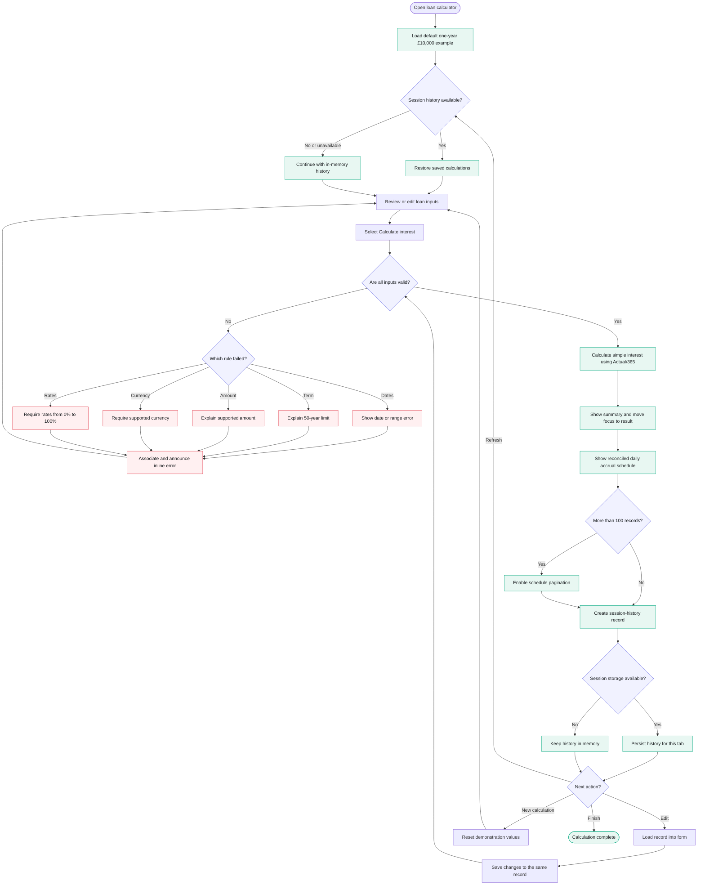

# User Flows and Acceptance Criteria

## End-to-end flow diagram

The source file is
[`docs/user-flows/loan-calculator-flow.mmd`](user-flows/loan-calculator-flow.mmd).
GitHub renders the diagram below directly from Mermaid syntax.

## 1. First visit and simple calculation

1. The calculator opens with a one-year, £10,000 example.
2. The user reviews or changes dates, principal, currency, base rate and margin.
3. Total annual rate updates immediately.
4. The user selects **Calculate interest**.
5. Focus moves to the result.
6. The result shows total interest, repayment composition, term, daily interest
   and assumptions.
7. The daily accrual schedule appears below, starting on the loan start date and
   ending the day before the end date.
8. A new record is added to session history.

## 2. Validation and recovery

| Case | Expected behavior |
| --- | --- |
| Missing start or end date | Explain which date must be selected |
| End date equal to/before start | Require an end date later than start |
| Period above 50 years | Explain the processing limit |
| Missing, zero or negative principal | Require an amount above zero |
| Principal above 1 trillion | Explain the supported maximum |
| Missing currency | Require a supported currency |
| Missing or negative rate/margin | Require zero or more |
| Rate or margin above 100% | Explain the supported maximum |
| Decimal amount/rates | Accept and calculate to currency precision |
| Zero base and zero margin | Produce a valid zero-interest schedule |

Submission remains on the form when invalid. Each error is associated with its
control, uses plain-language recovery copy and is announced to assistive
technology.

## 3. Date selection

1. The user can type dates into segmented date fields or open the calendar.
2. Calendar selection prompts for start first, then end.
3. Dates on or before the selected start are unavailable as end dates.
4. Escape cancels draft calendar changes and restores the committed range.
5. Done commits a valid range.
6. The interface states that the start is included and end is excluded.

## 4. Long schedule and pagination

1. Terms longer than 100 days show the first 100 rows.
2. Next and Previous move through bounded pages.
3. The final page contains only remaining rows.
4. Page buttons disable at the first and last page.
5. Record counts and the visible range update on each page.
6. Long loans do not allocate the entire schedule in memory.

## 5. History and edit-in-place

1. A successful calculation creates a history record.
2. **Edit** loads that record into the form and scrolls to it.
3. The form changes to **Edit calculation** and **Save changes**.
4. Saving updates the same record rather than creating a duplicate.
5. Created time is retained and a last-updated time is added.
6. **New calculation** resets to the default demonstration values.
7. History survives refresh in the same tab through session storage.
8. If browser storage is blocked or corrupt, calculation still works with
   in-memory history.

## 6. Currency and rounding

1. GBP, USD and EUR use locale-aware currency formatting.
2. Nominal interest is calculated at full JavaScript numeric precision.
3. Displayed daily amounts use cumulative two-decimal allocation.
4. The sum of displayed daily interest equals displayed total interest.
5. The final running total equals total interest.

## 7. Responsive and accessible behavior

- Desktop uses a two-column form/result workspace.
- Smaller screens use a single logical reading order.
- Wide tables scroll rather than clip.
- Every interactive control is keyboard reachable.
- Focus is visible and moves intentionally after calculate/edit actions.
- The repayment graphic has a text alternative and exact adjacent values.
- Reduced-motion preferences disable non-essential animation.

## 8. Deployment flow

1. Tests and the production build are run locally before changes are pushed.
2. A push to `main` triggers the connected Cloudflare deployment.
3. Cloudflare Pages builds with `npm run build` and publishes `dist`.
4. Relative production asset paths work on the deployed Cloudflare site.
